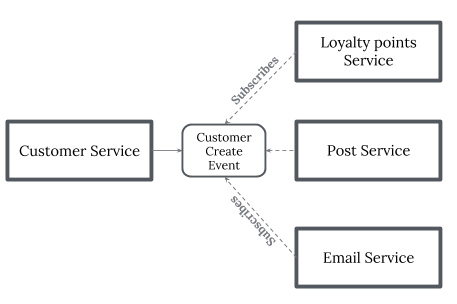
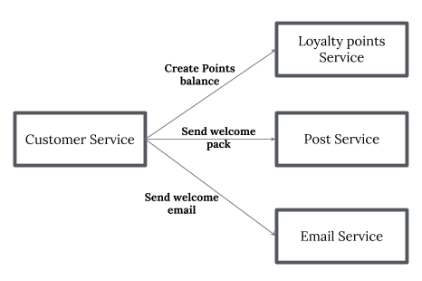

## Caching
https://d0.awsstatic.com/whitepapers/Database/database-caching-strategies-using-redis.pdf

## Clustering
- The process of organizing objects into groups whose members are similar in some way"

## Memcache vs Redis
- Both as key/value datastore
- Redis is more more "data structure store". Redis supports more datatypes as compard to memcache (strings, hashes, lists, sets, sorted sets with range queries, bitmaps, hyperloglogs, geospatial indexes with radius queries and streams)
- Memcached’s internal memory management,is more efficient in the simplest use cases because it consumes comparatively less memory resources for metadata. Strings (the only data type supported by Memcached) are ideal for storing data that is only read, because strings require no further processing
- Redis supports 6 eviction policies, whereas memcache only supports LRU policy
- Memcached could be preferable when caching relatively small and static data, such as HTML code fragments
- Memcached is multithreaded, you can easily scale (verticle scaling) up by giving it more computational resources, but you will lose part or all of the cached data (depending on whether you use consistent hashing)
- Redis is mostly single-threaded and can scale horizontally via clustering without loss of data. Clustering is an effective scaling solution, but it is comparatively more complex to set up and operate

# Cloud-init
Cloud-init is the industry standard multi-distribution method for cross-platform cloud instance initialization. It is supported across all major public cloud providers, provisioning systems for private cloud infrastructure, and bare-metal installations.

Cloud instances are initialized from a disk image and instance data:

Cloud metadata
User data (optional)
Vendor data (optional)
Cloud-init will identify the cloud it is running on during boot, read any provided metadata from the cloud and initialize the system accordingly. This may involve setting up the network and storage devices to configuring SSH access key and many other aspects of a system. Later on the cloud-init will also parse and process any optional user or vendor data that was passed to the instance.

## Service Mesh
- `Network communication infrastructure` which allows your to `decouple and offload most of the application network functions` from your service code.
- Hence when you do service-to-service communication, `you don’t need to implement resilient communication patterns such as Circuit breakers, timeouts in your service’s code`. 
- Service mesh provides other functionalities such as service discovery, observability etc.
- East-West
- Service mesh is used alongside most of the service implementations as a `sidecar` and it’s independent of the business functionality of the services.

### API Gateway
- API Gateway: `Exposes your services as managed APIs`
- Single point of entry for any microservice call
- Works as a proxy service to route a request to the concerned microservice
- Can aggregate the results to send back to the consumer
- Can also convert the protocol request and respond????
- Can also offload the authentication/authorization responsibility of the microservice.
- North-South
- API Gateways also come inbuilt support for:
    - Service discovery
    - Analytics(observability: Metrics, monitoring, distributed logging, distributed tracing) 
    - Security
    - Circuit Breakers
    - Timeouts, Caching
    - Load Balancing/Failover

> **_NOTE:_** An `edge service` is a component which is `exposed to the public internet`. It acts as a `gateway to all other services`, which we will refer to as platform services. For example, consider an Nginx reverse proxy in front of some web resource servers. Here, Nginx acts as an edge service by routing public HTTP requests to the appropriate platform service.

### [Service Mesh vs API Gateway](https://medium.com/microservices-in-practice/service-mesh-vs-api-gateway-a6d814b9bf56)
| API Gateway  | Service Mesh
|---|---
|  Part of the business functionality of your solution (Hosts all API services). API Gateway may have in-built inter-service communication capabilities but that doesn’t prevent API Gateway using service mesh to call downstream services(API Gateway->service mesh->microservices).|  Service mesh is used alongside most of the service implementations as a sidecar and it’s independent of the business functionality of the services.

> **_NOTE:_** At API Management level, you can either use in-built inter-service communication capabilities of API Gateway or API Gateway can call downstream services via service mesh by offloading application network functions to service mesh.

## Consistent hashing

## [Microservice service pattern](https://medium.com/@madhukaudantha/microservice-architecture-and-design-patterns-for-microservices-e0e5013fd58a)
- Observability Patterns
    - Log Aggregation
    - Performance Metrics
    - Distributed Tracing
    - Health Check
- Cross-Cutting Concern Patterns
    - Service Discovery Pattern
    - Circuit Breaker Pattern: - Rate limiting  
    When the number of consecutive failures crosses a threshold, the circuit breaker trips, and for the duration of a timeout period, all attempts to invoke the remote service will fail immediately. After the timeout expires the circuit breaker allows a limited number of test requests to pass through. If those requests succeed, the circuit breaker resumes normal operation.
    - Blue-Green Deployment Pattern
- Integration Patterns
    - API Gateway Pattern
    - Aggregator Pattern : Aggregate and send response 
    - Chained Microservice Pattern  
    The request received by a microservice-1, which is then communicating with microservice-2 and it may be communicating with microservice-3. All these services are synchronous calls.
    - Saga Pattern  
        - Choreography  
        
        When there is no central coordination, each service produces and listens to another service’s events and decides if an action should be taken or not. Choreography is a way of specifying how two or more parties; none of which has any control over the other parties’ processes, or perhaps any visibility of those processes — can coordinate their activities and processes to share information and value. Use choreography when coordination across domains of control/visibility is required. You can think of choreography, in a simple scenario, as like a network protocol. It dictates acceptable patterns of requests and responses between parties.
        - Orchestration  
        
        An orchestrator (object) takes responsibility for a saga’s decision making and sequencing business logic. when you have control over all the actors in a process. when they’re all in one domain of control and you can control the flow of activities. This is, of course, most often when you’re specifying a business process that will be enacted inside one organization that you have control over.
    

## Architecture considerations
- Tools - Infrastructure management, Configuration management
- Managed vs Hosted Services
- Containers vs Serveless

- Security
- Performance
- Availability (HA)
- Cost - Capacity planing
- Deployment - CI/CD
- Observability Monitoring
- Logging

