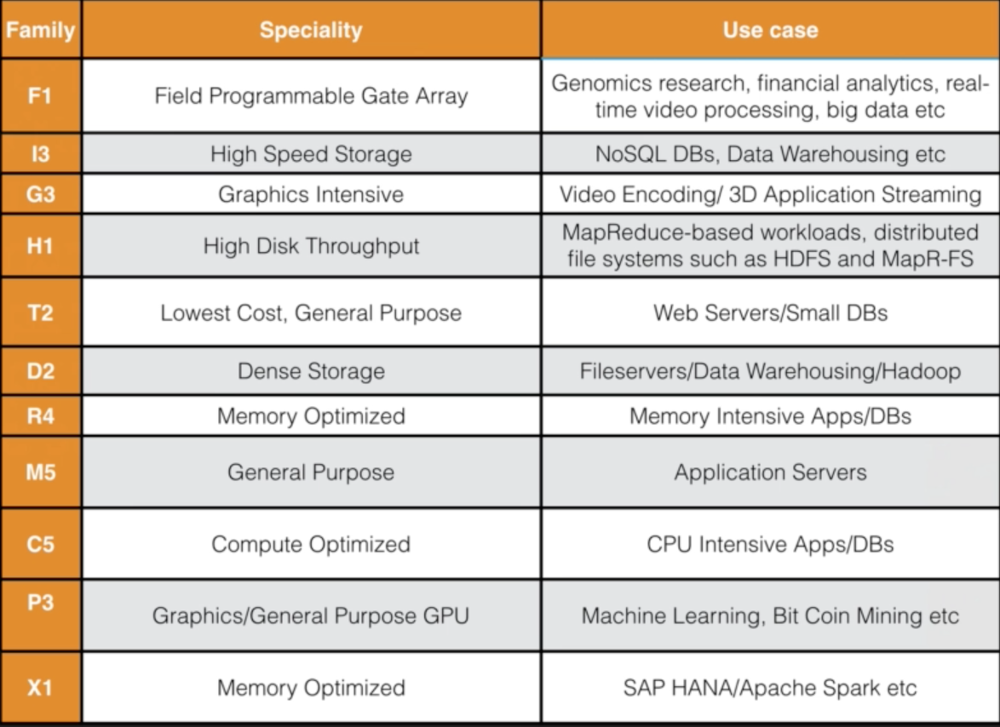
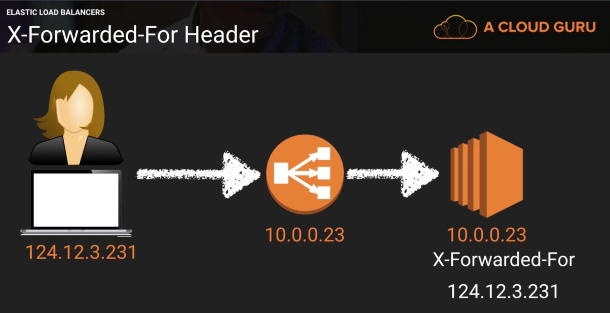
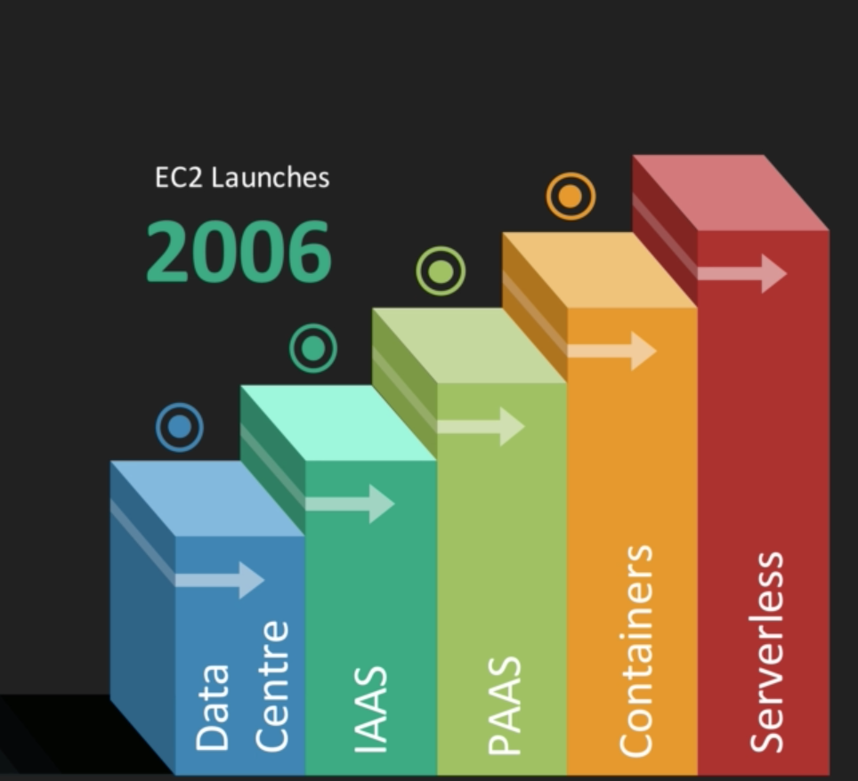

# Elastic Compute Cloud (EC2)

EC2 is a web service that provides resizable compute capacity in the cloud.
It's just a  virtual machine in the cloud and it reduces the time required to obtain and boot new servers to minutes allowing you to quickly scale capacity both up and down as you computing requirements change.

### EC2 options
- **On-Demand**:
  - Allows you to pay fixed rate by hour (or by seconds) with no commitment
  - Perfect for users that want the low cost and flexibility of Amazon EC2 without any upfront payment or long term commitment
  - Application with short term, spiky or unpredictable workloads that cannot be interrupted.
  - Applications being developed or tested on Amazon EC2 for the first time

- **Reserved**:
  - Provides you with a capacity reservation and offers significant discount on the hourly charge for an instance. 1 year or 3 year
  - Applications with steady state or predictable usage
  - Applications that require reserved capacity
  - Users can make upfront payment to reduce their total computing cost even further
    - Standard RI's (upto 75% off on-demand)
    - Convertable RI's (upto 54% off on-demand) features the ability to change the attributes of RI
    - Scheduled RI's are available to launch within the time window you reserve

- **Spot**:
  - Allows you to bid whatever price you want for instance capacity providing for even greater savings if your instances have flexible start and end time
  - Applications that have flexible start and end time
  - Applications that are feasible at very low compute prices
  - Users with an urgent need for large amount of additional computing capacity

- **Dedicated Hosts**: 
  - Physical EC2 servers decicated for your use. Dedicated hosts can help you reduce cost by allowing you to use your existing server bound software licenses
  - Useful for regulatory requirements that do not allow multi-tenancy
  - Can be purchesed on-demand (hourly)

### EC2 instance types

FIGHT DR MC PX

### System Status Check
Checks wheather insatance is reachable
These checks monitor if AWS systems required to use this instance and ensure they are functioning properly
In case of failure reboot/terminate

### Instance Status Check
Makes sure you can get traffic to the operating system
These checks monitor your software and network configuration for this instance
In case of failure reboot the instance so that it gets launched on different host

### Security Group
 - Virtual firewall for your instances
 - One security group can be applied to multiple instances
 - All Inbound traffic is blocked by default
 - All Outbound traffic is allowed
 - Changes to security group take effect immediately
 - You can have any number of EC2 instances within security group
 - You can have multiple EC2 instances attached to security group
 - Security group are **STATEFUL**
   If you create an inbound rule allowing traffic in, that traffic is automatically allowed back out again
 - You cannot block specific IP address using security groups instead use Network Access Control List (STATELESS)
 - You can specify allow rules but not deny rules
 - 60 Inbound or outbound rules per security group
 - 2500 VPC security groups per Region

# Elastic Block Storage (EBS)

### EBS Volume types
 - **General Purpose SSD (GP2)**
    - General purpose, balances both price and performance
    - Ratio of 3 IOPS/GB with up to 10k IPOS with the ability to burst upto 3k IOPS for extended period of time for volumes at 3334 GiB and above
 - **Provisioned IOPS SSD (IO1)**
    - Designed for IO intensive operations such as large relational or NoSQL DB's
    - Use if needed more than 10k IOPS
    - Provision upto 20k IOPS per volume
 - **Throughput optimized HDD (ST1)**
    - Before SSD we had magnetic storage volume
    - Big data
    - Log processing
    - Data warehousing
    - Cannot be a boot volume
 - **Cold HDD (SC1)**
    - Cannot be a root volume
    - Low cost storage for infrequently accessed workloads
    - File server
 - **Magnetic (Standard)**
    - Lowest cost per gigabyte of all EBS volume types that is bootable
    - These are ideal for workloads where data is accessed infrequently
    - Suitable for applications where the lowest storage cost is important

### Volumes and Snapshots
- Volumes exists on EBS
    - Virtual Hard Disk
- Snapshots exist on S3
- Snapshots are point in time copies of Volumes
- Snapshots are incremental - this means that only the blocks that have changed since the last snapshots are moved to S3
- **Security**
    - EBS root volumes of default AMI's cannot be encrypted
 Snapshots of encrypted volumes are going to be encrypted automatically
    - Volumes restored from encrypted snapshots are encrypted automatically
    - You can share snapshots only if they are encrypted

### Snaphsot of Root Device Volumes
- To take the snapshot of EBS volumes that serve as root device, you should stop the instance before taking the snapshot
- You can create AMI's from EBS backed instances and snapshots
- You can change EBS volume size and type on the fly (best practise is to stop the instance)
- EBS volume will always be in the same AZ as the instance
- To move EBS volume from one AZ to another, take a snaphot or image of it and then copy it to the new AZ/region

# Redundant Array of Independent Disk (RAID)
RAID arrays are used when you are not getting the desired IO

### Types of RAID array

- **RAID 0**:
  - Striped: Multiple disks striped (combined) togather to form a single volume
  - No Redundancy: If any of the volume fails whole RAID array would fail
  - Good Performance
  - Typically used in gaming
- **RAID 1**:
  - Mirrored: You got one disk and you mirror exact copy of it to another disk
  - Redundancy: If one disk fails you can still use the RAID array using another disk
- **RAID 5:**
    - You get 3 disks or more and you are writing parity to another disk
	- Amazon discourages you from making RAID 5 array on EBS volumes
	- Parity is a checksum. If one of the disks fails, you can read the RAID array and using checksum you can find what the missing data is
- **RAID 10:**
  - Combination of RAID 0 and RAID 1.Striped and Mirrored. Good Redundancy and Good Performance

### Taking Sanpshot of RAID array
  - **Problem**
  Snapshot excludes data held in application and OS cache. This does not matter if using single volume RAID array. If using multiple multiple volumes in RAID array this can be problem due to independencies of RAID array
 - **Solution:**
    Stop application from writing to the disk, Flush all caches to the disk.
	This can be done using
	 - Freeze the file system
	 - Unmount RAID array
	 - Stop EC2 instance

### Volumes & Snapshots
 - You can create an image out of EC2 instance
 - You can take a snaphot of Volumes
 - You can create and image from Volume
 - You can transfer snapshot/volume from one region to another, make them public or transfer it to another AWS account
- AWS provided AMI's are not encrypted
- You can share snapshots only if they are encrypted
- Snapshots of encrypted volumes are encrypted automatically
- Volumes restored from encrypted snapshots are encrypted automatically

# Amazon Machine Image (AMI)

You can select AMI based on:
 - Region
 - Architecture (32/64 bit)
 - Operating System
 - Launch Permissions
 - Storage for Root Device
  - Instance backed (Ephemeral storage [not durable])
    - Cannot be stopped
	- If the host dies, you lose you lose your instance
	- Root device is created from template stored in S3
	- Provisioning is slow
	- With instance termination, by default, root volume will be deleted. There is no wy to tell AWS to keep root volume device
  - EBS backed
    - Can be stopped
	- Volume can be attached to another instance
	- Root device is created from an EBS snapshot
	- Provisioning is faster
	- With instance termination, by default, root volume will be deleted However you can tell AWS to keep root volume device

# Elastic Load Balancers (ELB)
 - Virtual applicance (machine)
 - Instances monitored by ELB are reported as InService or OutofService
 - Health checks check the instance health by talking to it
 - Have their own DNS. Their IP address is not published since it might change
 - Types

  - **Application Load Balancer (ALB)**
    - Best suited for load balancing HTTP/HTTPS traffic
	- Operates at layer 7 and are application aware (X-forwarded, Sticky sessions)
	  - X-Forwarded-For header: Forwards public IP of the client to EC2 instance passing through load balancers. Verious API's are available which can tell Country, Organisation where the Public IP request is coming from


  - ** Network Load Balancer (NLB)**
    - Best suited for load balancing TCP traffic where extreme performane is required
    - Operates at layer 4
	- Capable of handling millions of requests per second while maintaining ultra low latencies

  - **Classic Load Balancers (CLB)**
    - Legacy ELB
	- You can load balance both HTTP/HTTPS and TCP traffic
	- If application stops responding, ELB responds with 504 error (gateway timeout).
	  It means application is not responding within the ideal timeout period. This could be either at Web server layer or Database layer

# Cloud Watch
 - **Dashboards**: Creates awesome dashboards to see what is happening with your AWS environment
 - **Alarms**: allows you to set Alarms that notify you when perticular threasholds and hit
 - **Logs**: CLoudWatch logs helps you to aggregate monitor and store logs
 - Standard Monitoring is 5 minutes, Detailed Monitoring is 1 minute
 - **Events**:
   CloudWatch Events helps you to respond to state changes in your AWS resources. When your resources change state they automatically send events into an event stream. You can create rules that match selected events in the stream and route them to targets to take action. You can also use rules to take action on a pre-determined schedule. For example, you can configure rules to:
    - Automatically invoke an AWS Lambda function to update DNS entries when an event notifies you that Amazon EC2 instance enters the Running state
	- Direct specific API records from CloudTrail to a Kinesis stream for detailed analysis of potential security or availability risks
	- Take a snapshot of an Amazon EBS volume on a schedule

CloudWatch is for Monitoring and logging whereas AuditTrails is for Auditing (Role/S3/User creation etc...)

# EC2 instance metadata
Instance metadata is data about your instance that you can use to configure or manage the running instance.
```
[root@jump_host1.hf2254.aries.mobileiron.net 2018-09-22--07-34-17 ~ #] curl http://169.254.169.254/latest/meta-data/
ami-id
ami-launch-index
ami-manifest-path
block-device-mapping/
events/
hostname
instance-action
instance-id
instance-type
local-hostname
local-ipv4
mac
metrics/
network/
placement/
profile
public-hostname
public-ipv4
public-keys/
reservation-id
security-groups
```

# Placement Groups
You can launch or start instances in a placement group, which determines how instances are placed on underlying hardware
#### Types
You specify one of the following strategies for the group:
  - **Cluster**
    - A cluster placement group is a logical grouping of instances within a single Availability Zone. A placement group can span peered VPCs in the same region.
    - Cluster placement groups are recommended for applications that benefit from low network latency, high network throughput, or both, and if the majority of the network traffic is between the instances in the group.
	- To provide the lowest latency and the highest packet-per-second network performance for your placement group, choose an instance type that supports enhanced networking
	- It is recommend that you launch the number of instances that you need in the placement group in a single launch request and that you use the same instance type for all instances in the placement group. If you try to add more instances to the placement group later, or if you try to launch more than one instance type in the placement group, you increase your chances of getting an insufficient capacity error.
	- If you stop an instance in a placement group and then start it again, it still runs in the placement group. However, the start fails if there isn't enough capacity for the instance.
	- If you receive a capacity error when launching an instance in a placement group that already has running instances, stop and start all of the instances in the placement group, and try the launch again. Restarting the instances may migrate them to hardware that has capacity for all the requested instances.
	
  - **Spread**
    - A spread placement group is a group of instances that are each placed on distinct underlying hardware
	- Spread placement groups are recommended for applications that have a small number of critical instances that should be kept separate from each other. Launching instances in a spread placement group reduces the risk of simultaneous failures that might occur when instances share the same underlying hardware
	- Spread placement groups provide access to distinct hardware, and are therefore suitable for mixing instance types or launching instances over time
	- A spread placement group can span multiple Availability Zones, and you can have a maximum of seven running instances per Availability Zone per group
	- If you start or launch an instance in a spread placement group and there is insufficient unique hardware to fulfill the request, the request fails. Amazon EC2 makes more distinct hardware available over time, so you can try your request again later.

#### Limitations
  - The name you specify for a placement group must be unique within your AWS account for the region
  - You can't merge placement groups
  - An instance can be launched in one placement group at a time; it cannot span multiple placement groups
  - Reserved Instances provide a capacity reservation for EC2 instances in a specific Availability Zone. The capacity reservation can be used by instances in a placement group. However, it is not possible to explicitly reserve capacity for a placement group.
  - Instances with a tenancy of host cannot be launched in placement groups.

#### Cluster Placement Group Rules
  - The following are the only instance types that you can use when you launch an instance into a cluster placement group:
    - General purpose: M4, M5, M5d
	- Compute optimized: C3, C4, C5, C5d, cc2.8xlarge
	- Memory optimized: cr1.8xlarge, R3, R4, R5, R5d, X1, X1e, z1d
	- Storage optimized: D2, H1, hs1.8xlarge, I2, I3, i3.metal
	- Accelerated computing: F1, G2, G3, P2, P3
	- A cluster placement group can't span multiple Availability Zones

- The maximum network throughput speed of traffic between two instances in a cluster placement group is limited by the slower of the two instances. For applications with high-throughput requirements, choose an instance type with 10–Gbps or 25–Gbps network connectivity.
- Instances within a cluster placement group can use up to 10 Gbps for single-flow traffic.
- Traffic to and from Amazon S3 buckets within the same region over the public IP address space or through a VPC endpoint can use all available instance aggregate bandwidth
- You can launch multiple instance types into a cluster placement group. However, this reduces the likelihood that the required capacity will be available for your launch to succeed. We recommend using the same instance type for all instances in a cluster placement group.
- Network traffic to the internet and over an AWS Direct Connect connection to on-premises resources is limited to 5 Gbps

#### Spread Placement Group Rules
 - A spread placement group supports a maximum of seven running instances per Availability Zone. For example, in a region with three Availability Zones, you can run a total of 21 instances in the group (seven per zone). If you try to start an eighth instance in the same zone and in the same spread placement group, the instance will not launch. If you need to have more than seven instances in an AZ, then the recommendation is to use multiple spread placement groups. This does not provide guarantees about the spread of instances between groups, but does ensure the spread for each group to limit impact from certain classes of failures
 - Spread placement groups are not supported for Dedicated Instances or Dedicated Hosts

# Lambda



  - AWS Lambda is a compute service where you can upload your code and create a Lambda function
  - AWS Lambda takes care of provisioning and managing the server required to run your code
  - You dont have to worry about operating system, patches, load balancers, scaling
  - You pay only for the compute time you consume - there is no charge when your code is not running.
  - You can set up your code to automatically trigger from other AWS services or call it directly from any web or mobile app.
  - Scales out automatically but does not scale up
  - Lambda function can trigger another Lambda function or other AWS service
  - Some triggers only available in certain regions
  - Lambda is priced based on the number of requests and duration to execute that request. The price depends on the amount of memory allocated to your function
  - Lambda function execution has threshold of 5 minutes
  - Serverless, Continuous scaling, Cheap
  - Usecase: You can use AWS Lambda to execute code in response to triggers such as changes in data, shifts in system state, or actions by users. Lambda can be directly triggered by AWS services such as S3, DynamoDB, Kinesis, SNS, and CloudWatch, or it can be orchestrated into workflows by AWS Step Functions. This allows you to build a variety of real-time serverless data processing systems.


# Misc
- Bootstrap scripts

# Explore
- SG - All Outbound traffic is allowed vs If you create an inbound rule allowing traffic in, that traffic is automatically allowed back out again
- EBS IOPS
- Why not always use RAID 10
- Using Cassandra with RAID array
- DMZ
- CloudWatch custom alarms (https://docs.aws.amazon.com/AWSEC2/latest/UserGuide/monitoring_ec2.html)
- Scaling down Auto-instance group
