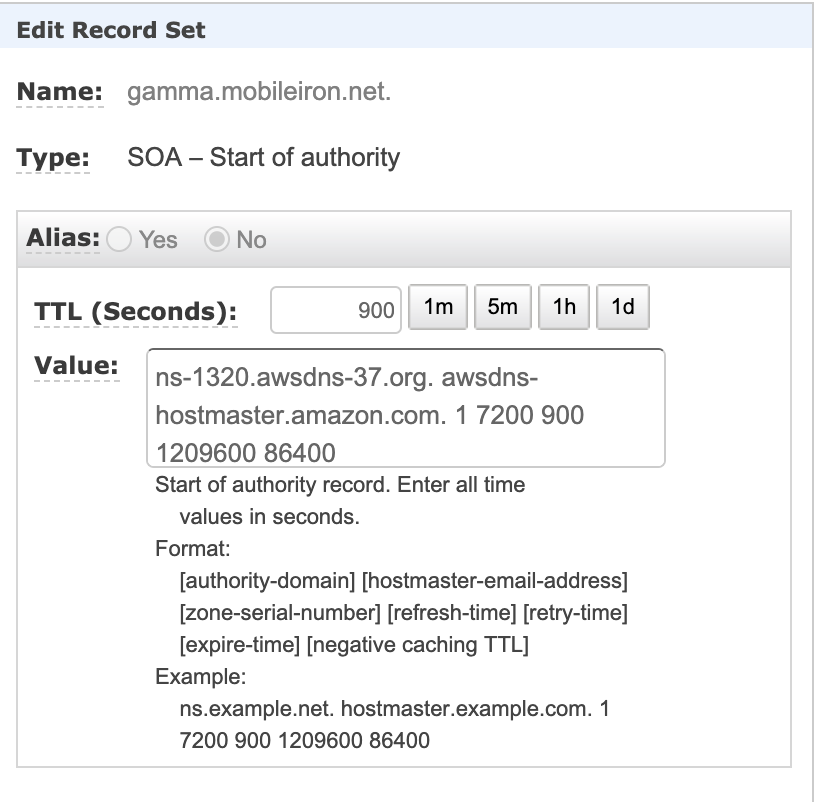
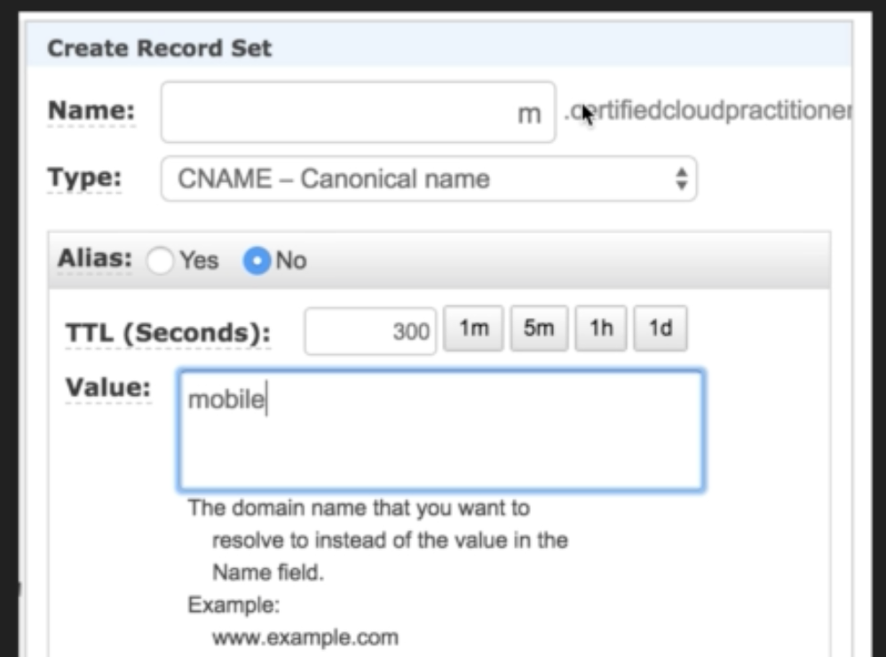
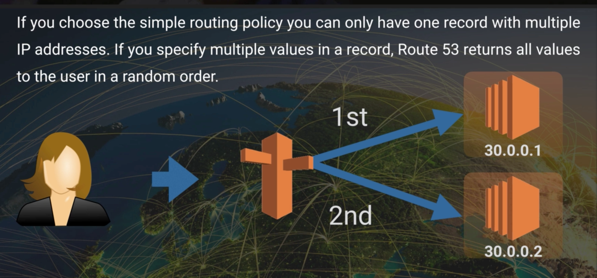
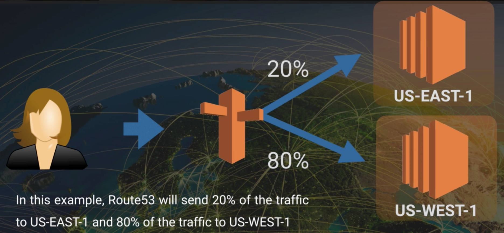
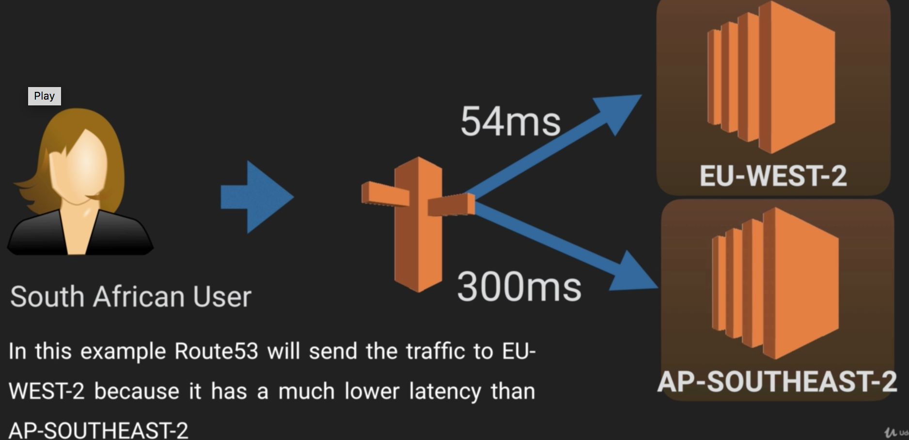
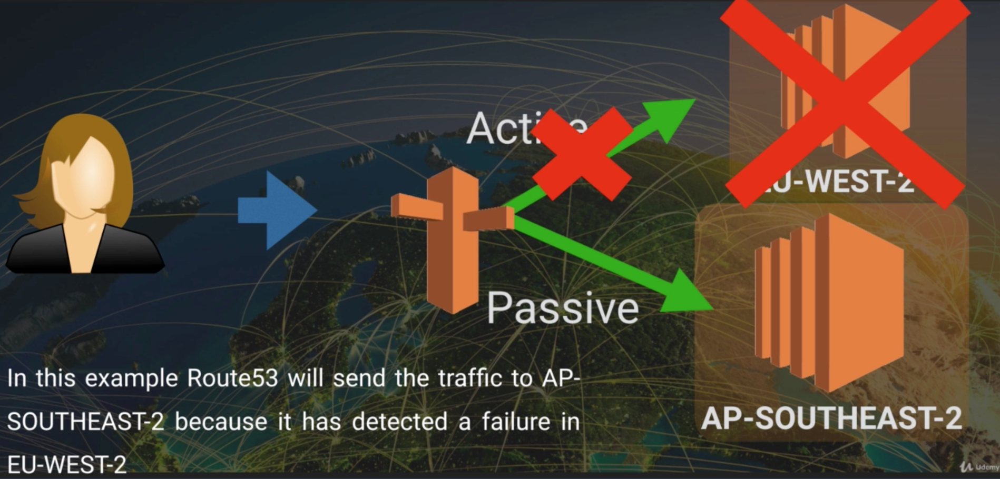
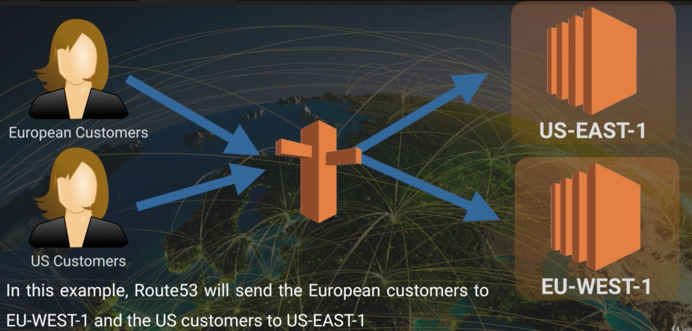

# Route53

- DNS is used to convert human friendly domain names to Internet Protocol (IP) address
- IP addresses come in 2 different forms IPv4 and IPv6
- IPv4 space is a 32-bit field and has over 4B different address (created in pre internet days)
- IPv6 was created to solve depletion issue and has 128bit address space (340 undecillion addresses)
- In domain name `www.google.com the last word, .com, represents top level domain name and the second word, google, represents second level domain` name
- Top level domain names are controlled by I`nternet Assigned Numbers Authority (IANA)` in a root zone database which is essentially a database of all available top level domains. (http://www.iana.org/domains/root/db)
- Domain Registrars: Authority that can assign domain name directly under one or more top-level domains (goDaddy). These domain names are registered with **InterNIC**, a service of **ICANN**, which enforcess uniqueness of domain names across the internet. Each domain name is registered in central database known as **WhoIS** database.
- State-Of-Authority (SOA) record: Stores information about:

  - Name of the server that supplied data for the zone
  - Administrator of the zone
  - Current version of data file
  - Default number of seconds for ttl file on resource records
- Name Server (NS) records: They are used by the top level Domain Servers to redirect traffic to the Content DNS server which contains Authoratative DNS records

## Routing policies
- **Address (A) Record**: It translates name of the domain to IP address

- **TTL**: Time DNS record is cached on either a `resolving server or the users own local PC` is equal to the value of the TTL in seconds. Lower the TTL, faster the changes to DNS record take to propogate throughout the internet

- ** Cannonical Name (CNAME)**: Used to `resolve one domain name to other. DNS to DNS redirection.` For example you might have mobile website with the domain name, http://m.hfarooqui.com for mobile users and you also want http://www.hfarooqui.com to resolve to same address.

- **Alias Record**: Alias records are `used to map resource record set in hosted zone to AWS resources` (ELB, S3, CloudFront, AmazonMQ). Alias record work like CNAME record in that you can map one DNS namec (www.test.com) to another DNS name (elb123.elb.amazonaws.com). Key difference however is CNAME cannot be used for naked domain names. For instance you cannot have CNAME for http://mobileiron.com it must either be A Record or Alias. Since Alias record use DNS name, any changes to AWS resource IP address does not effect the hosted zone that contains resource record set.

- **MX records**: Mail server records. Points Domain name to email service

- **PTR records**: Used for reverse lookup

### Simple Routing Policy
- One record with multiple IP address
- Route53 returns all the values to the users in a random order

### Weighted Routing Policy
- Lets you split your traffic based on the weights assigned 
- Can have more than one A record

###  Latency-based Routing Policy
- Lets you route your traffic based on lowest network latency for your end user (i.e. which region will give you fastest response time)

###  Failover Routing Policy
- Used when you want to create Active/Passive setup
- Route53 will monitor the health of your primary site using a health check
- Health check monitors health of your endpoints

### Geolocation Routing Policy
- Lets you choose where your traffic will be sent based on the geographic location of your users

### Multivalue Routing Policy
- Similar to Simple routing policy but can have multiple A records and health checks associated with each record. Hence if one of the health check fails all the requests are redirected to healthy records.
- Can have up to 12 multivalue answer records and route53 responds to DNS queries with up to 8 healthy records

