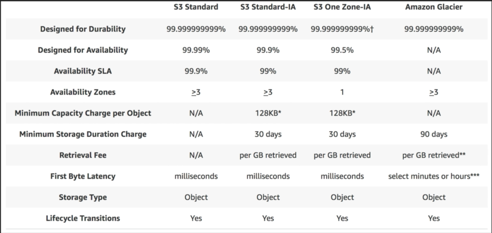
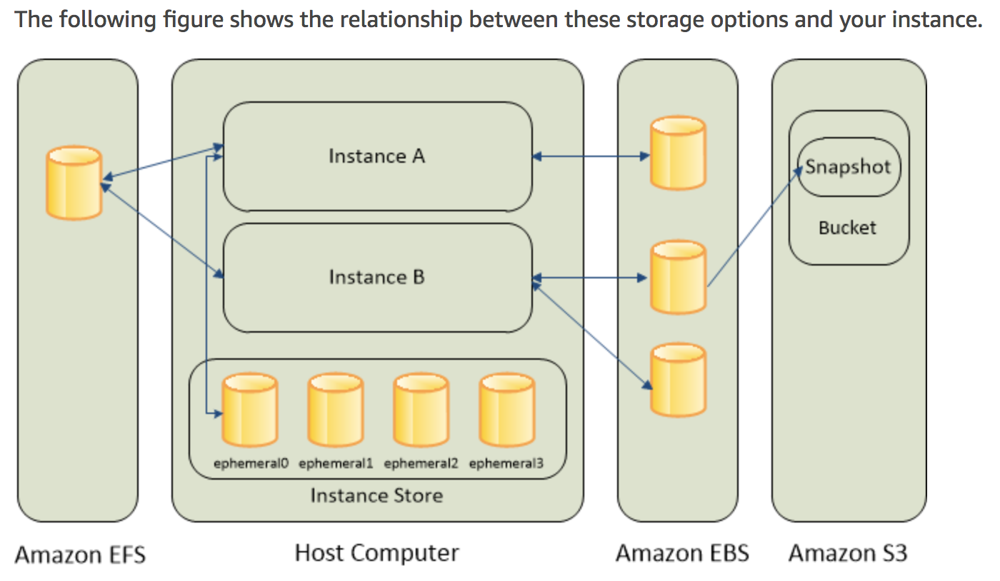
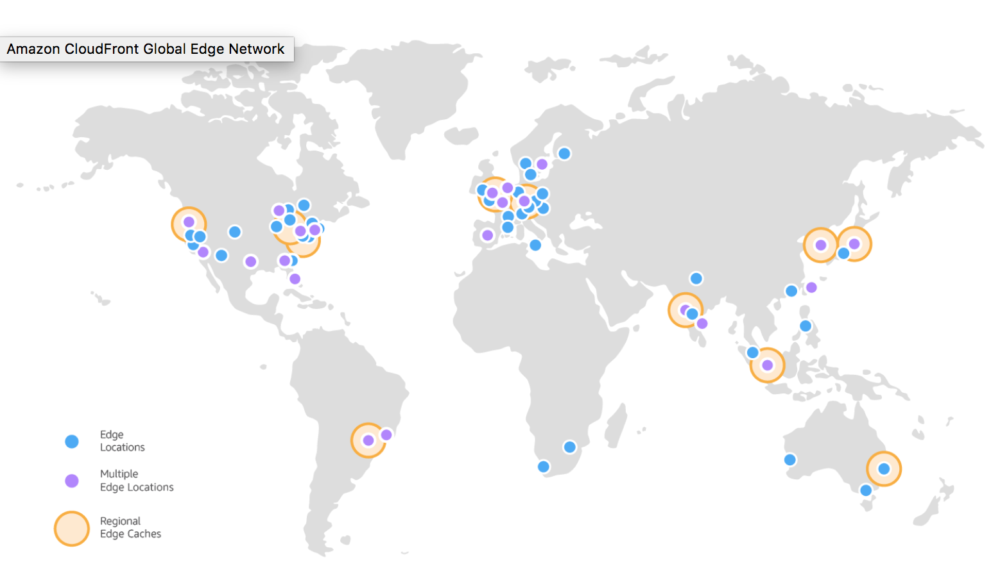
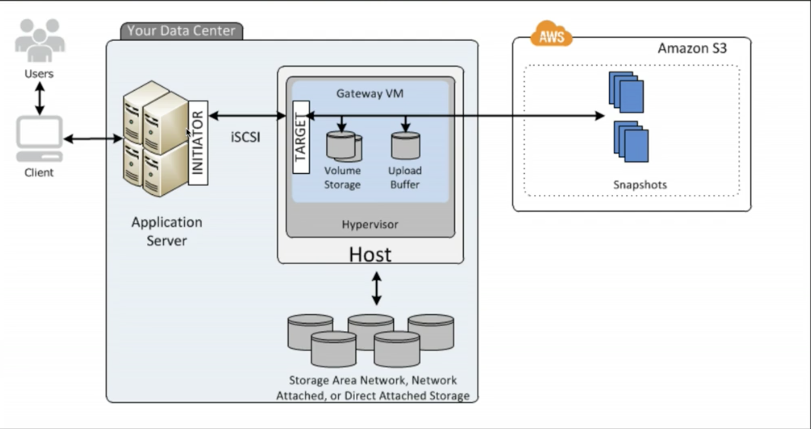
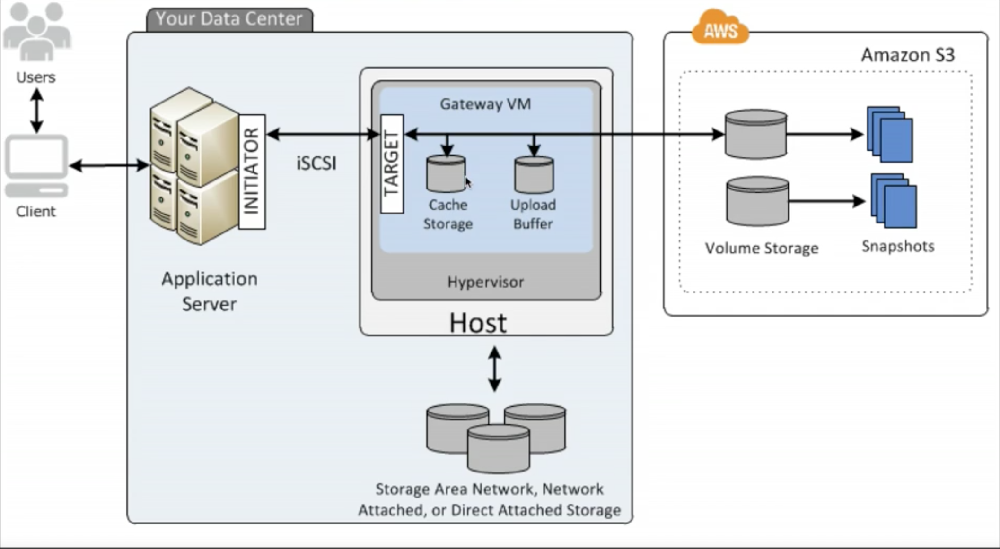
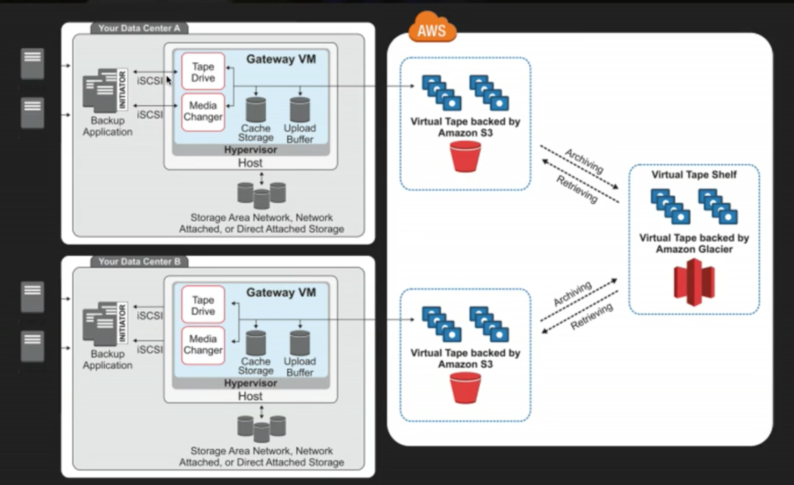
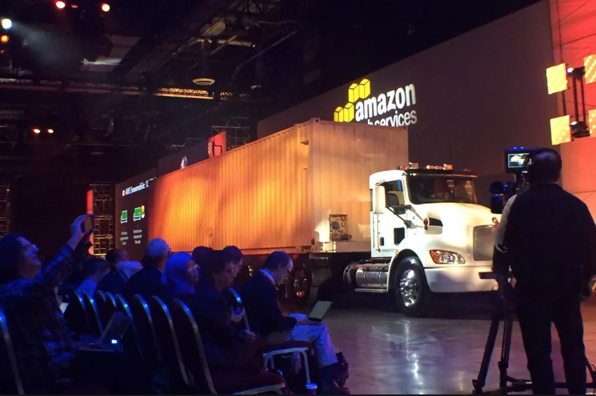

# Simple Storage Service (S3)

### The Basics
- Secure, durable and highly Object based storage
- Data is spread across multiple devices and facilities
- Allows you to upload files ranging from 0 bytes to 5 TB
- Unlimited storage but you pay for usage per GB
- Files ares stored in buckets (Folder in cloud)
- S3 is universal namespace i.e. name must be unique globally. 
E.g. https://<bucket-name>.s3-website-<AWS-region>.amazonaws.com
- You will receive HTTP 200 if file upload to S3 bucket was successful
- 99.99% availability
- 99.99999999999% (11 9's) durability (cannot lose file)
- Tiered storage
 - **S3 Standard**: 99.99% availability, 99.99999999999% durability, stored reduntantly across multiple devices in multiple facilities, designed to sustain loss of 2 facilities concurrently. No retrival fee but most expsnsive.
  - **S3 IA** (Infrequently accessed): For data that is accessed less frequently but require rapid access when needed. Cheaper compared to "S3 Standard" but you are charged a retrival fee. (Also referred as Reduced Redundancy Storage [RRS])
  - **S3 One Zone IA**: Data stored only in one AZ. Cheaper than above tow tiers
  - **Glacier**: Cheapest but used for data archival only. Expedidated, Standard or Bulk. Standard retrival takes around 3-5 hours

- Charges are for:
	- Storage
	- Retrival/Requests
	- Storage Management Pricing
	- Data Transfer Pricing
		- Transfer Acceleration: Enables fast, easy and secure transfers of files over long distances between end users and S3 bucket. It takes advantage of Amazons CloudFront's globally distributed Edge locations (much closer to end user compared to S3 location). As the data arrives at Edge location it is routed to Amazons S3 over optimized network path
- Lifecycle management (E.g. Delete files older than 30 days or move it from one storage tier to another)

### Security & Encryption
- By default buckets are **private** and all the files stored inside the bucket are private
- S3 buckets can be configured to create **access logs** which logs all the requests made to S3 bucket
- **Encryption**
  - In Transit: Transfer data to and from bucket
    - SSL/TLS
  - At Rest
   - Server side encryption
     -  Amazon S3 Managed Keys (SSE-S3)
	   Each object is encrypted with unique key employing strong multi factor authentication. Amazon encrypts and regulary rotates the master key. Amazon handles all the keys
     -  Key Management Service (SSE-KMS)
	   Comes with additional benifits and charge. Seperate permission for use for envalope key. Envalope key is the key that protects the data's encryption key. It provides Audit Trails feature as to who is using the key (who is decrypting what and when)
     - Customer provided keys (SSE-C)
	   You manage the key and Amazon manages the encryption
    - Client side encryption
   You encrypt the data on your client side and upload it

### Data consistancy model for S3
- Read after write consistancy for PUTS of new objects
(File is available for read immediately after it is uploaded)
- Eventual consistsncy for overwrite PUTS and DELETS (When you update or delete the existing file you might still get the old copy if you attempt to read it. The reason being it take few seconds to update/delete file to different AZ's)

### S3 Components
- Key: Name of the object (file)
- Value: Data inside the file
- Version Id: File version
- Metadata: Data about data. (Tags)
- Subresources:
 - ACL: Define permisssions for files in the bucket
 - S3 bucket policies: Applied at bucket level
 - Torrent: Useful for torrenting?

### Versioning
- Stores all versions of an Object (including all writes and even if you delete an object)
- Great bakcup tool
- Once enabled, versioning cannot be deleted only suspended
- Integrates with lifecycle rules
- Versioning MFA (multi factor authentication) delete feature adds extra layer of security
- Versioning must be enabled on both, source and destination
- Regions must be unique
- Files in the source bucket are not replicated automatically. All the subsequent updated files will be replicated automatically
- Delete markers are replicated
- Deleting individual versions or delete markers will not be replicated

# Elastic Block store
Amazon Elastic Block Store (Amazon EBS)
Use Amazon EBS to provide storage for the drives of your virtual machines. It stores data in equally-sized blocks and organizes them into a hierarchy similar to a traditional file system. The volumes are provisioned in size and attached to EC2 instances in a way that’s similar to the local disk drive on a physical machine. Here are EBS’ benefits and use cases:

Amazon EBS Benefits
- Performance optimization: Increase throughput by devoting network capacity and minimizing the network contention between your instances and EBS.
- Low-latency performance: By using SSD EBS volumes, it offers reliable I/O performance scaled to meet your workload needs.
- Highly available and secure storage: EBS volumes offer redundancy within its Availability Zones while access control and encryption bolster security.
- Geographic interchangeability: With EBS, you can duplicate snapshots throughout AWS regions and place resources and data in multiple locations. This makes disaster recovery, data center migration, and geographical expansion simple.
- Easy data backup and restoration: Point-in-time volume snapshots safeguard data.
- Rapid up- or down-scaling: EBS can quickly scale volumes, ensuring you get the right performance and capacity for changing computing needs.

Amazon EBS Use Cases
- Testing and development: You can scale, archive, duplicate or provision your testing, development, or production environments.
- NoSQL databases: EBS offers NoSQL databases the low-latency performance and dependability they need for peak performance.
- Relational databases: EBS scales to meet your changing storage needs. This makes it a great choice for deploying databases, including PostgreSQL, MySQL, Oracle, or Microsoft SQL Server.
- Business consistency: Copy EBS Snapshots and Amazon Machine Images (AMIs) to run applications in different AWS regions. This reduces data loss and speeds recovery time by backing up log files and data regularly, across geographies.
- Enterprise-wide applications: It can meet a variety of enterprise computing needs through powerful block storage that can support your most important applications, such as Microsoft Exchange, Oracle, or Microsoft SharePoint.

# Elastic File System (EFS)
-  File storage service for EC2
- You can mount EFS to multiple instances (with EBS you cant')
- EFS is block based storage
- Supports NFSv4
- Can scale upto Petabytes
- Can support 1000s of NFS concurrent connections
- Data is stored across multiple AZ's within a region
- Pay only for what you use ($0.30/GB)
- Read after write consistancy
- EFS and corresponding instances need to reside under same SG

# Instance Store (Ephemeral storage)
  - Not durable
  - An instance store provides temporary block-level storage for your instance. This storage is located on disks that are physically attached to the host computer.
  - Instance store is ideal for temporary storage of information that changes frequently, such as buffers, caches, scratch data, and other temporary content, or for data that is replicated across a fleet of instances, such as a load-balanced pool of web servers
  - An instance store consists of one or more instance store volumes exposed as block devices. The size of an instance store as well as the number of devices available varies by instance type. While an instance store is dedicated to a particular instance, the disk subsystem is shared among instances on a host computer
  - The virtual devices for instance store volumes are ephemeral[0-23]. Instance types that support one instance store volume have ephemeral0. Instance types that support two instance store volumes have ephemeral0 and ephemeral1, and so on.
  - Instances with Instance Store cannot be stopped
  - If the host dies, you lose you lose your instance
  - Root device is created from template stored in S3
  - Provisioning is slow
  - Cannot be detached and reattached to other instances
  - With instance termination, by default, root volume will be deleted. There is no wy to tell AWS to keep root volume device

# EBS vs EFS vs S3
https://www.missioncloud.com/blog/resource-amazon-ebs-vs-efs-vs-s3-picking-the-best-aws-storage-option-for-your-business

# Content Delivery Network (CDN)
CDN is a content delivery network and is a `system of distributed servers (network)` that deliver web pages and other web content to a user based on the geographic location of that user, the origin of the web page and a content delivery server.

### Teminology
**Origin:** The Origin of all the files that CDN will distribute. Could be EC2 instance, S3 bucket, ELB or Route 53. Origin does have to be an AWS resource, you can very well have your custom Origin  
**Edge Location:** Location where content will be cached. Edge locaiton are not just read-only. You can write to the Edge location which will be later syncd with the Origin.
Objects are cached to Edge location for the life of TTL. You can clear cached location but will be charged. Access for first user will always be slow as the contents will be downloaded and cached and downloaded to Edge location. All the subsequent request to the same content will be faster as it will be retrived from cached Edge locations. 

Regional Edge Caches are CloudFront locations that are deployed globally, at close proximity to your viewers. These locations sit between your origin server and the global edge locations that serve traffic directly to your viewers. As the popularity of your objects reduce, individual edge locations may evict those objects to make room for more popular content. Regional Edge Caches have larger cache width than any individual edge location, so your objects remain in cache longer at the nearest regional edge cache location. 

**Distribution**: Name given to CDN which consists of collection of Edge locations
 - ** Web Distribution**: Typically used for websites
 - **RTMP**: Used for media streaming
 
 ### Storage Gateway
 On-premise virtual applicance which can be used to cache S3 locally at customers site
 - **File Gateway:** For flat files stored directly on S3
 - **Volume Gateway:**
  - **Storage Volume:** Entire dataset is store on-site and is asynchronously backedup to S3
  - **Cached Volume:** Entire dataset is stored in S3 and only the most recently accessed data is cached on-site
 -** Gateway Virtual Tape Library (VTL):** Used for backups and uses polular backup applications like NetBackup, Backup Exec, Veeam etc
 

# Snowball

Before Snowball Amazon used import/export disk which accelerates moving large amount of data in and out of AWS cloud using portable storage device for transport.
Served the purpose if you had low internet bandwidth and had to transfer TB's of data. However, the problem was manging different types of disk with different connections. To overcome this issue Amazon came with Snowball.

**Snowball**
- PB scale data transport solution that uses secure applicance to transfer large amout of data in and out of AWS.
- Simple, fast, secure and can cost as little as one fifth the cost of internet
- 80TB Snowball in all the regions
- Uses multiple layer of security including tamper resistant enclosures, 256-bit encryption
- Once the data is transfered AWS performs a software erasure (cleanup) of Snowball appliance so that future customer is not able to recover the deleted data

**Snowball Edge**
- Is a 100TB of data transfer device which severs as little AWS datacenter with not just on board storage but also compute capabilities
- Can cluster togather to form a local storage tier and process your data on-premise, heling ensure your applications continue to run even when they are not able to access the cloud

**Snowmobile**
- Massive safe container on the back of a truck
- Strores 100 PB of data per container
- Would take around 6 months to transfer Exabytes of data with Snowmobile. Where as with 10 MBPS it would have taken 25 years

# S3 Transfer Acceleration
S3 transfer acceleration uses CloudFront's Edge location to accelerate your uploads to S3 bucket. instead of uploading directly to the S3 bucket you can use distinct url to upload directly to an Edge location which will than upload the file to S3. You will get the distinct url to upload to: <bucket_name>.s3-accelerate.amazonaws.com

# Static (Serverless) website hosting
- DomainName and Bucket name should be same for your static website (hosted with S3) to work
- Format http://<bucket_name>.s3-website-<region>.amazonaws.com
- Serveless - Do not have to worry about EC2 instances or VM's
- Scales infinately
- Its a static website. Cannot have php, aspx, javascript

