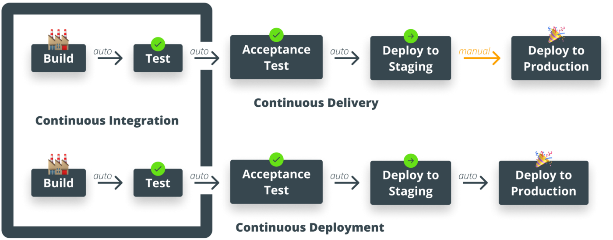
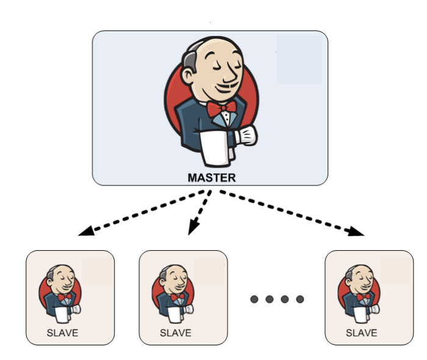

## Jenkins

### Continuous integration
Your application always builds and passes its tests, including all the pieces from different sub-teams.

### Continuous delivery
Your application always builds and deploys to a test environment and passes its tests.

### Continuous deployment
Your application is always ready to deploy to production through a largely automated process.

- Automated code quality and Code coverage metrics are run along with unit tests to continuously evaluate the code quality.

### Master Slave architecture

#### Node
- Node is used to refer to all machines that are part of Jenkins grid, slaves and master

#### Master
• Schedule build jobs
• Dispatch builds to the slaves for the actual job execution
• Monitor the slaves and record the build results
• Can also execute build jobs directly

#### Slave
- Slaves are computers that are set up to build projects for a master
- Jenkins runs a separate program called "slave agent" on slaves
- When slaves are registered to a master, a master starts distributing loads to slaves
- Execute build jobs dispatched by the master

### Job/Project
Runnable tasks that are controlled / monitored by Jenkins

### Plugin
A Plugin, like plugins on any other system, is a piece of software that extends the core functionality of the core Jenkins server.
E.g.
- FindBugs plugin: Find bugs in Java program
- Multi pipeline plugin
- BitBucket plugin
- Checkstyle is a code static analysis tool to help programmers to write
Java code that adheres to a coding standard such as
  - Avoiding multiple blank lines;
  - Removing unused variables;
  - Enforcing correct indentations;

### Different Phases in Maven Build Lifecycle
- Validate: Validate the project is correct and all necessary information is available.
- Compile Compile the source code of the project.
- Test: Test the compiled source code using a suitable unit testing framework.
- Package Take the compiled code and package it in its distributable format.
- Verify Run any checks on results of integration tests to ensure quality criteria are met.
- Install: Install the package into the local repository, for use as a dependency in other projects locally.
- Deploy: Copy the final package to the remote repository for sharing with other developers and projects.