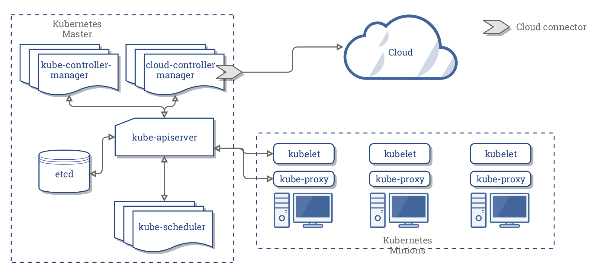

# Kubernetes

EKS version - 1.17


## Overview
- Kubernetes is an `open-source container management platform` which holds the responsibilities of container deployment, scaling & descaling of containers & load balancing
- Docker builds the containers and these containers communicate with each other via Kubernetes. Containers running on multiple hosts can be manually linked and orchestrated using Kubernetes
- Kubernetes is cloud-agnostic and can run on any public/private providers 
- Automated Scheduling
- Self healing
- Load balancing
- Rolling updates



## Master Components
#### kube-apiserver
- API server is a component of the Kubernetes control plane that exposes the Kubernetes API. T
- API server is the front end for the Kubernetes control plane.
- Main implementation of a Kubernetes API server is `kube-apiserver`. 
- `kube-apiserver` is designed to `scale horizontally`— that is, it scales by deploying more instances. You can run several instances of kube-apiserver and balance traffic between those instances.

#### etcd
- Consistent and `highly-available key value store` used as `Kubernetes’ backing store` for all cluster data.

#### kube-scheduler
- Component on the master that `watches newly created pods` that have no node assigned, and `selects a node` for them to run on.
- Factors taken into account for scheduling decisions include individual and collective resource requirements, `hardware/software/policy constraints, affinity and anti-affinity specifications`, data locality, inter-workload interference and deadlines.

#### kube-controller-manager
- Component on the master that runs controllers.
- Logically, `each controller is a separate process`, but to reduce complexity, they are all `compiled into a single binary and run in a single process`.
- These controllers include:
  - <b>Node Controller</b>: Responsible for noticing and responding when nodes go down.
  - <b>Replication Controller</b>: Responsible for maintaining the correct number of pods for every replication controller object in the system.
  - <b>Endpoints Controlle</b>r: Populates the Endpoints object (that is, joins Services & Pods).
  - <b>Service Account & Token Controllers</b>: Create default accounts and API access tokens for new namespaces.

#### cloud-controller-manager
- cloud-controller-manager `runs controllers that interact with the underlying cloud providers.` 
- The cloud-controller-manager binary is an alpha feature `introduced in Kubernetes release 1.6.`
- cloud-controller-manager `runs cloud-provider-specific controller loops only`. You must disable these controller loops in the kube-controller-manager. 
- You can disable the controller loops by setting the `--cloud-provider=external` when starting the kube-controller-manager.
- cloud-controller-manager `allows the cloud vendor’s code and the Kubernetes code to evolve independently of each other`. 
- In prior releases, the `core Kubernetes code was dependent upon cloud-provider-specific code` for functionality. 
- In future releases, code specific to cloud vendors should be maintained by the cloud vendor themselves, and linked to cloud-controller-manager while running Kubernetes.
- The following controllers have cloud provider dependencies:
  - <b>Node Controller</b>: For checking the cloud provider to determine if a node has been deleted in the cloud after it stops responding
  - <b>Route Controller</b>: For setting up routes in the underlying cloud infrastructure
  - <b>Service Controller</b>: For creating, updating and deleting cloud provider load balancers
  - <b>Volume Controller</b>: For creating, attaching, and mounting volumes, and interacting with the cloud provider to orchestrate volumes

## Node Components

#### kubelet
- An agent that runs on each node in the cluster. It `makes sure that containers are running in a pod.`

#### kube-proxy 
- `Network proxy` that runs on each node in your cluster, implementing part of the `Kubernetes Service` concept.
- kube-proxy `maintains network rules` on nodes. These network rules `allow network communication to your Pods` from network sessions inside or outside of your cluster.
- kube-proxy uses the operating system `packet filtering layer` if there is one and it’s available. Otherwise, kube-proxy forwards the traffic itself.

#### Container Runtime
The container runtime is the software that is responsible for running containers (dockerd, containerd, rktlet)

### Horizontal Pod Autoscaler (hpa)

- Automatically `scales the number of pods` in a replication controller, deployment or replica set based on `observed CPU utilization` (or, with `custom metrics` support, on some other application-provided metrics).  
- hpa does not apply to objects that can’t be scaled, for example, DaemonSets
- Implemented as a `Kubernetes API Resource` and a `Controller`
  - Resource determines the behavior of the controller
  - Controller periodically adjusts the number of replicas in a replication controller or deployment to match the observed average CPU utilization to the target specified by user
- hpa is implemented as a control loop, with a period controlled by the controller manager’s 
`--horizontal-pod-autoscaler-sync-period` flag (with a default value of 15 seconds)
- During each period, the `controller manager queries the resource utilization against the metrics specified in each HorizontalPodAutoscaler definition`. The controller manager obtains the metrics from either the `resource metrics API` (for per-pod resource metrics), or the `custom metrics API` (for all other metrics)
- E.g. `kubectl autoscale rs foo --min=2 --max=5 --cpu-percent=80`
- hpa does not work with rolling update using direct manipulation of replication controllers since hpa wont bind to new replication controllers. It only works with deployment object which in turn controls replica set
- `thrashing`- number of replicas keeps fluctuating frequently due to the dynamic nature of the metrics evaluated

## Rolling updates
The preferred way to create a `replicated applicatio`n is to use a `Deployment`, which in turn uses a `ReplicaSet`
 #### Update using confguration file
 ```
kubectl rolling-update my-nginx -f ./my-nginx.yaml

Created my-nginx-v4
Scaling up my-nginx-v4 from 0 to 5, scaling down my-nginx from 4 to 0 (keep 4 pods available, don't exceed 5 pods)
Scaling my-nginx-v4 up to 1
Scaling my-nginx down to 3
Scaling my-nginx-v4 up to 2
Scaling my-nginx down to 2
Scaling my-nginx-v4 up to 3
Scaling my-nginx down to 1
Scaling my-nginx-v4 up to 4
Scaling my-nginx down to 0
Scaling my-nginx-v4 up to 5
Update succeeded. Deleting old controller: my-nginx
replicationcontroller "my-nginx-v4" rolling updated
```

#### Update using spec property (container image)
```
# Update the pods of frontend-v1 to frontend-v2
kubectl rolling-update frontend-v1 frontend-v2 --image=image:v2

# Update the pods of frontend, keeping the replication controller name
kubectl rolling-update frontend --image=image:v2
```

If you encounter a problem, you can stop the rolling update midway and revert to the previous version using --rollback:
```
kubectl rolling-update my-nginx --rollback
```

## Security
### [Pod Security Policies](https://kubernetes.io/docs/concepts/policy/pod-security-policy/)
Pod Security Policies enable fine-grained authorization of pod creation and updates.
Control aspect / User case
- Running of privileged containers - `privileged`
- Restricting escalation to root privileges	- `allowPrivilegeEscalation` `defaultAllowPrivilegeEscalation`
- Usage of the host filesystem - `allowedHostPaths`
- Usage of volume types	- `volumes`
- Linux capabilities - `defaultAddCapabilities` `requiredDropCapabilities` `allowedCapabilities`
- The sysctl profile used by containers	- `forbiddenSysctls` `allowedUnsafeSysctls`
E.g.
```
apiVersion: policy/v1beta1
kind: PodSecurityPolicy
metadata:
  name: privileged
  annotations:
    seccomp.security.alpha.kubernetes.io/allowedProfileNames: '*'
spec:
  privileged: true
  allowPrivilegeEscalation: true
  allowedCapabilities:
  - '*'
  volumes:
  - '*'
  hostNetwork: true
  hostPorts:
  - min: 0
    max: 65535
  hostIPC: true
  hostPID: true
  runAsUser:
    rule: 'RunAsAny'
  seLinux:
    rule: 'RunAsAny'
  supplementalGroups:
    rule: 'RunAsAny'
  fsGroup:
    rule: 'RunAsAny'
  ```

#### RBAC
RBAC is a standard Kubernetes authorization mode, and can easily be used to authorize use of policies.
First, a Role or ClusterRole needs to grant access to use the desired policies. The rules to grant access look like this:
```
apiVersion: rbac.authorization.k8s.io/v1
kind: ClusterRole
metadata:
  name: <role name>
rules:
- apiGroups: ['policy']
  resources: ['podsecuritypolicies']
  verbs:     ['use']
  resourceNames:
  - <list of policies to authorize>
```
Then the (Cluster)Role is bound to the ServiceAccount (recommended) or User (non-rocommended):
```
apiVersion: rbac.authorization.k8s.io/v1
kind: ClusterRoleBinding
metadata:
  name: <binding name>
roleRef:
  kind: ClusterRole
  name: <role name>
  apiGroup: rbac.authorization.k8s.io
subjects:
# Authorize specific service accounts:
- kind: ServiceAccount
  name: <authorized service account name>
  namespace: <authorized pod namespace>
# Authorize specific users (not recommended):
- kind: User
  apiGroup: rbac.authorization.k8s.io
  name: <authorized user name>
```

 If a `RoleBinding` (not a `ClusterRoleBinding`) is used, it will only `grant usage for pods being run in the same namespace` as the binding. This can be paired with system groups to grant access to all pods run in the namespace. <br>
 To authorize all the `ServiceAccount` in a namespace:
```
# Authorize all service accounts in a namespace:
- kind: Group
  apiGroup: rbac.authorization.k8s.io
  name: system:serviceaccounts
# Or equivalently, all authenticated users in a namespace:
- kind: Group
  apiGroup: rbac.authorization.k8s.io
  name: system:authenticated
```


## [The 4C's of Cloud Native Security](https://kubernetes.io/docs/concepts/security/overview/)

#### Cloud
- `Infrastructure security`: VPC, Security Groups, Private network/DNS, TLS, Private, dedicated connections
- `DDoS Mitigation`: ASG, Amazon CloudFront and Amazon Route 53 help to mitigate DDoS
- `Data Encryption`: KMS, Message encryption (SQS), Data encryption (RDS,EBS), CloudHSM
- `Inventory and Configuration`:  `Amazon Inspector`, that automatically assesses applications for vulnerabilities or deviations from best practices, including impacted networks, OS, and attached storage
- `Monitoring and Logging`: CloudWatch, CloudTrail
- `IAM`
- `Penetration testing`

#### Cluster
- Use `Transport Layer Security` (TLS) for all API traffic
- `API Authentication`: IAM, LDAP
- `API Authorization`: RBAC, NodeRestriction (to avoid updating labels)
- `Kubelet authentication/authorization `(by default provides unauthenticaetd access to the API)
- Limiting resource usage on a cluster
  - `Resource quota` limits the number or capacity of resources (CPU, Memory, Disk) granted to a namespace.
  - `Limit ranges` restrict the maximum or minimum size of some of the resources (Memory)
- Restricting cloud `metadata API access` (http://169.254.169.254/latest/meta-data/instance-id)
- Restricting `network access`: The network policies for a namespace allows application authors to restrict which pods in other namespaces may access pods and ports within their namespaces
- `Controlling which nodes pods may access`: NodeSelector, Taint and Tolerance, NodeAffinity
- `Restrict access to etcd`
- `etcd encryption`
- Enable `audit logging`
- Restrict access to `alpha or beta features`
- Review `third party integrations` before enabling them
- `Encrypt secrets at rest` (ETCD, config files)

#### Container
-  On regular basis you should `scan your containers for known vulnerabilities` with a tool such as `CoreOS’s Clair`
- `Signing container images` and maintaining a system of trust for the content of your containers. `Docker Content Trust`, `IBM’s Portieris`
- `Disallow privileged users`: create users inside of the containers that have the least level of operating system privilege necessary in order to carry out the goal of the container.

#### Code
- TLS access
- Limiting port ranges of communication
- 3rd Party Dependency Security with no CVE’s currently filed against them
- Static Code Analysis: scan codebases for common security errors using code analysis tools
- Dynamic probing attacks: Use automated tools to detect SQL injection, CSRF, and XSS

## [The 4C's of Cloud Native Security](https://kubernetes.io/docs/concepts/security/overview/)
[](images/4c.png)
### Cloud Security
#### Cloud provider security
- Identity and Access Control - Allow authorized access using IAM Roles and policies
- Network and Infrastructure Security - Protect your workloads from malicious or unauthorized traffic.
- Logging, Monitoring, Threat Detection, and Analytics - Centralized logging, reporting, and analysis of logs to provide visibility and security insights.
- Host and Endpoint Security
- Data Protection and Encryption
#### Infrastructure security
| Area of Concern for Kubernetes Infrastructure  | Recommendation
|---|---|---|---|---|
| Network access to API Server (Control plane)  | All access to the Kubernetes control plane is not allowed publicly on the internet and is controlled by network access control lists restricted to the set of IP addresses needed to administer the cluster.
|	Network access to Nodes (nodes)   | Nodes should be configured to only accept connections (via network access control lists)from the control plane on the specified ports, and accept connections for services in Kubernetes of type NodePort and LoadBalancer. If possible, these nodes should not be exposed on the public internet entirely.
| Kubernetes access to Cloud Provider API  | Each cloud provider needs to grant a different set of permissions to the Kubernetes control plane and nodes. It is best to provide the cluster with cloud provider access that follows the principle of least privilege for the resources it needs to administer. The Kops documentation provides information about IAM policies and roles.
| Access to etcd |Access to etcd (the datastore of Kubernetes) should be limited to the control plane only. Depending on your configuration, you should attempt to use etcd over TLS.
| etcd Encryption	| Wherever possible it's a good practice to encrypt all drives at rest, but since etcd holds the state of the entire cluster (including Secrets) its disk should especially be encrypted at rest.

### Container security
- Image Signing and Enforcement
- Container Vulnerability Scanning and OS Dependency Security
- Disallow privileged users inside containers

### Cluster security
There are two areas of concern for securing Kubernetes:
- Securing the cluster components that are configurable
- Securing the applications which run in the cluster
RBAC Authorization (Access to the Kubernetes API) - RBAC is a standard Kubernetes authorization mode, and can easily be used to authorize use of policies.
Authentication (Controlling Access to the Kubernetes API)
TLS For Kubernetes Ingress

### Code security
- Access over TLS only
- Limiting port ranges of communication
- Dynamic probing attacks (SQL injection, CSRF, and XSS. One of the most popular dynamic analysis tools is the OWASP Zed Attack proxy tool)

## Kubernetes Design Patterns
### Foundational patterns
Represent the principles and best practices that containerized applications
- Health Probe pattern - Define `probes` for `liveness` and `rediness` checks
- Predictable Demands pattern - Define `limit` and `requests` on `resources` 
- Automated Placement patterns - workload distribution in a multi-node cluster, Pod scheduling
### Structural patterns
- Init Container pattern - Init Containers enable separation of concerns by providing a separate life cycle for initialization-related tasks distinct from the main application containers
- Sidecar patterns - Describes how to extend and enhance the functionality of a pre-existing container without changing it (E.g. logging)
### Behavioral patterns
- Service Discovery pattern - How clients can access and discover the instances that are providing application services
- Stateful Service patterns - How to create and manage distributed stateful applications with Kubernetes
### Higher-level patterns
- Controller pattern - Controller is a pattern that actively monitors and maintains a set of Kubernetes resources in a desired state (Managed by EKS?)
- Operator pattern - Allows us to extend the Controller pattern for more flexibility and greater expressiveness.
  E.g. Argo CD (Continuous delivery tool for Kubernetes), Elastic Cloud on Kubernetes (Run Elasticsearch, Kibana, APM Server, Enterprise Search, and Beats on Kubernetes and OpenShift), Istio (Installs and maintain Istio service mesh)

## Assigning Pods to Nodes
Generally such constraints are unnecessary, as the scheduler will automatically do a reasonable placement (e.g. spread your pods across nodes, not place the pod on a node with insufficient free resources, etc.)
User cases:
- To ensure that a pod ends up on a machine with an SSD attached to it
- To co-locate pods from two different services that communicate a lot into the same availability zone.


### Taint and Tolerations
- Node affinity is a property of pods that attracts them to a set of nodes (either as a preference or a hard requirement). - 
- Taints are the opposite – they allow a node to repel a set of pods.
- Taints and tolerations work together to ensure that pods are not scheduled onto inappropriate nodes. 
- One or more `Taints are applied to a node` this marks that the node should not accept any pods that do not tolerate the taints. 
- `Tolerations are applied to pods`, and allow (but do not require) the pods to schedule onto nodes with matching taints.
```
kubectl taint nodes node1 key=value:NoSchedule
```

You specify a toleration for a pod in the PodSpec. Both of the following tolerations “match” the taint created by the kubectl taint line above, and thus a pod with either toleration would be able to schedule onto node1:
```
tolerations:
- key: "key"
  operator: "Equal"
  value: "value"
  effect: "NoSchedule"
```
```
tolerations:
- key: "key"
  operator: "Exists"
  effect: "NoSchedule"
```
A toleration “matches” a taint if the keys are the same and the effects are the same, and:
- the operator is Exists (in which case no value should be specified), or
- the operator is Equal and the values are equal
Operator defaults to Equal if not specified.

Effect types:
`NoSchedule` - No pod will be able to schedule onto node unless it has a matching toleration.
`PreferNoSchedule` - This is a “preference” or “soft” version of NoSchedule – the system will try to avoid placing a pod that does not tolerate the taint on the node, but it is not required
`NoExecute` - Any pods that do not tolerate the taint will be evicted immediately, and pods that do tolerate the taint will never be evicted

For example, imagine you taint a node like this
```
kubectl taint nodes node1 key1=value1:NoSchedule
kubectl taint nodes node1 key1=value1:NoExecute
kubectl taint nodes node1 key2=value2:NoSchedule
```
And a pod has two tolerations:
```
tolerations:
- key: "key1"
  operator: "Equal"
  value: "value1"
  effect: "NoSchedule"
- key: "key1"
  operator: "Equal"
  value: "value1"
  effect: "NoExecute"
```
In this case, the pod will not be able to schedule onto the node, because there is no toleration matching the third taint. 
But it will be able to continue running if it is already running on the node when the taint is added, because the third taint is the only one of the three that is not tolerated by the pod.

Normally, if a taint with effect `NoExecute` is added to a node, then any pods that do not tolerate the taint will be evicted immediately, and pods that do tolerate the taint will never be evicted. However, a toleration with `NoExecute` effect can specify an optional `tolerationSeconds` field that dictates how long the pod will stay bound to the node after the taint is added. For example,
```
tolerations:
- key: "key1"
  operator: "Equal"
  value: "value1"
  effect: "NoExecute"
  tolerationSeconds: 3600
```
means that if this pod is running and a matching taint is added to the node, then the pod will stay bound to the node for 3600 seconds, and then be evicted. If the taint is removed before that time, the pod will not be evicted.


```
# Using `bootstrap.sh` in user-data
/etc/eks/bootstrap.sh $EKS_CLUSTER_NAME --kubelet-extra-args --register-with-taints=host=argus:NoSchedule
```

### Labels and Node selectors
### Node selector
- nodeSelector is the simplest recommended form of node selection constraint
- nodeSelector is a field of PodSpec. It specifies a map of key-value pairs
- For the pod to be eligible to run on a node, the node must have each of the indicated key-value pairs as labels (it can have additional labels as well). The most common usage is one key-value pair
```
kubectl label nodes argus-portal.1 disktype=ssd
```
```
apiVersion: v1
kind: Pod
metadata:
  name: nginx
  labels:
    env: test
spec:
  containers:
  - name: nginx
    image: nginx
    imagePullPolicy: IfNotPresent
  nodeSelector:
    disktype: ssd
 ```
`NodeRestriction` admission plugin prevents kubelets from setting or modifying labels with a `node-restriction.kubernetes.io/ prefix`. Supported in v1.11+ Add labels under the node-restriction.kubernetes.io/ prefix to your Node objects, and use those labels in your node selectors. For example, `example.com.node-restriction.kubernetes.io/fips=true` or `example.com.node-restriction.kubernetes.io/pci-dss=true`

```
# Using `kubectl label nodes`
kubectl label nodes <node-name> <label-key>=<label-value>
E.g. kubectl label nodes ip-172-30-17-140.ec2.internal mobileiron.io/worker=argus

# Using `bootstrap.sh` in user-data
/etc/eks/bootstrap.sh $EKS_CLUSTER_NAME --kubelet-extra-args --node-labels=mobileiron.io/worker=argus
```
Add selector to your Pod/Deployment/DaemonSet configuration
```
apiVersion: apps/v1
kind: DaemonSet
metadata:
  labels:
    app.kubernetes.io/instance: fluentd-forwarder-argusr
  name: fluentd-forwarder-argus
spec:
  containers:
  - name: fluentd-forwarder-argus
    image: 492608340914.dkr.ecr.us-east-1.amazonaws.com/fluentd-forwarder:1.0.0-5.release
    imagePullPolicy: IfNotPresent
  nodeSelector: 
    mobileiron.io/worker: argus
```
> **_NOTE:_**  The `NodeRestriction` admission plugin prevents kubelets from setting or modifying labels with a `node-restriction.kubernetes.io/` prefix. To make use of that label prefix for node isolation:

### Affinity and Anti-affinity
- The affinity/anti-affinity language is `more expressive`. The language offers more matching rules besides exact matches created with a logical AND operation
- You can indicate that the rule is `"soft"/"preference" rather than a hard requirement`, so if the scheduler can't satisfy it, the pod will still be scheduled
- You can constrain against labels on other pods running on the same node (or other topological domain), rather than against labels on the node itself, which allows rules
Categorized into two types:
#### Node affinity
Conceptually similar to nodeSelector -- it allows you to constrain which nodes your pod is eligible to be scheduled on, based on labels on the node.
- requiredDuringSchedulingIgnoredDuringExecution (hard)
   E.g. Only run the pod on nodes with Intel CPUs"

- preferredDuringSchedulingIgnoredDuringExecution (soft)
  E.g  Try to run this set of pods in failure zone XYZ, but if it's not possible, then allow some to run elsewhere

 > **_NOTE:_**  The `"IgnoredDuringExecution"` part of the names means that, similar to how nodeSelector works, if labels on a node change at runtime such that the affinity rules on a pod are no longer met, the pod will still continue to run on the node. In the future we plan to offer `requiredDuringSchedulingRequiredDuringExecution` which will be just like `requiredDuringSchedulingIgnoredDuringExecution` except that it will evict pods from nodes that cease to satisfy the pods' node affinity requirements.
 
```
apiVersion: v1
kind: Pod
metadata:
  name: with-node-affinity
spec:
  affinity:
    nodeAffinity:
      requiredDuringSchedulingIgnoredDuringExecution:
        nodeSelectorTerms:
        - matchExpressions:
          - key: kubernetes.io/e2e-az-name
            operator: In
            values:
            - e2e-az1
            - e2e-az2
      preferredDuringSchedulingIgnoredDuringExecution:
      - weight: 1
        preference:
          matchExpressions:
          - key: another-node-label-key
            operator: In
            values:
            - another-node-label-value
  containers:
  - name: with-node-affinity
    image: k8s.gcr.io/pause:2.0
```

#### Inter-pod affinity and anti-affinity 
- Allow you to constrain your pod based on `labels on pods rather than based on labels on nodes`
- `label selector` over pod labels must specify which namespaces the selector should apply to
- The rules are of the form "this pod should (or, in the case of anti-affinity, should not) run in an X if that X is already running one or more pods that meet rule Y". `Y is expressed as a LabelSelector with an optional associated list of namespaces;` unlike nodes, because pods are namespaced (and therefore the labels on pods are implicitly namespaced), a label selector over pod labels must specify which namespaces the selector should apply to. Conceptually `X is a topology domain expressed using topologyKey like node, rack, cloud provider zone, cloud provider region etc`

 > **_NOTE:_** Note: Inter-pod affinity and anti-affinity require substantial amount of processing which can slow down scheduling in large clusters significantly. We do not recommend using them in clusters larger than several hundred nodes.

 > **_NOTE:_** Note: Pod anti-affinity requires nodes to be consistently labelled, in other words every node in the cluster must have an appropriate label matching topologyKey. If some or all nodes are missing the specified `topologyKey` label, it can lead to unintended behavior.
```
apiVersion: v1
kind: Pod
metadata:
  name: with-pod-affinity
spec:
  affinity:
    podAffinity:
      requiredDuringSchedulingIgnoredDuringExecution:
      - labelSelector:
          matchExpressions:
          - key: security
            operator: In
            values:
            - S1
        topologyKey: failure-domain.beta.kubernetes.io/zone
    podAntiAffinity:
      preferredDuringSchedulingIgnoredDuringExecution:
      - weight: 100
        podAffinityTerm:
          labelSelector:
            matchExpressions:
            - key: security
              operator: In
              values:
              - S2
          topologyKey: failure-domain.beta.kubernetes.io/zone
  containers:
  - name: with-pod-affinity
    image: k8s.gcr.io/pause:2.0
```
- The affinity on this pod defines one `podAffinity` rule and one `podAntiAffinity` rule. 
- `topologyKey` cannot be empty
- The `podAffinity is requiredDuringSchedulingIgnoredDuringExecution` <br>
   It  says that the pod can be scheduled onto a node only if that node is in the same zone as at least one already-running pod that has a label with key `"security" and value "S1"`. (More precisely, the pod is eligible to run on node N if node N has a label with key `failure-domain.beta.kubernetes.io/zone` and some value V such that there is at least one node in the cluster with key `failure-domain.beta.kubernetes.io/zone` and value V that is running a pod that has a label with key "security" and value "S1".)

- The `podAntiAffinity is preferredDuringSchedulingIgnoredDuringExecution`.<br>
  It says that the pod cannot be scheduled onto a node if that node is in the same zone as a pod with label having key "security" and value "S2".

### Definitions
- <b>Metrics Server</b> is a cluster-wide aggregator of resource usage data. Resource metrics are used by components like kubectl top and the Horizontal Pod Autoscaler to scale workloads
- <b>Prometheus Adapter</b> To autoscale based upon a custom metric