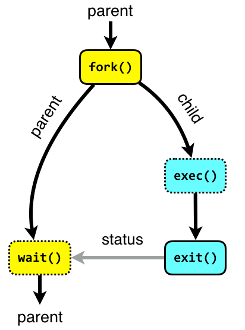

## Linux Distributions
3 main distributions
#### Debian based
  - The grand daddy. Supported by largest community
  - Very stable
  - Use debian vanilla in production
  - For Desktop envionments use Ubuntu, LinuxMint(Not very secure, was breached Feb 2016, popular among non-technical users)
#### REHL based
  - Managed by RedHat enterprise which provides support. Useful for business critical environments.
  - Very reliable and secure
  - Use lightwight CentOS in production
  - For Desktop environments use Fedora
  - Little behind Debian community in terms of package availability
#### Arch based
  - Run by the so called elites
  - Had latest and greatest packages
  - Not very stable if using 'AUR' (builds program for you with single command line). Uses "pacman" package manager
  - Use Manjaro to get your hands dirty

Other distrbutions include Gentu, ClearOS(Intel)
## Shell Commands

#### User
- Create user: <b> usermod $USERNAME </b>
- Set Password: <b> passwd $USERNAME </b>
- Lock an account: <b> passwd -l $USERNAME </b>
- Unlock an account: <b> passwd -u $USERNAME </b>
- Login as service user: <b> sudo -u $SERVICE_USER bash </b>
- Add user to group: <b> sudo usermod -a -G $GROUPNAME $USERNAME </b>
- Set hostname: <b> hostnamectl set-hostname $NEW_HOSTNAME </b>

- Open port (centos 7): <b> sudo firewall-cmd --zone=public --permanent --add-port=8090/tcp && sudo service firewalld restart </b>

#### VirtualBox
- Enable ssh to vbox from mac: Add "Bridge Adapter" network to VM

- Add fixed IP to vm:   
sudo vi /etc/sysconfig/network-scripts/ifcfg-enp0s3   
TYPE=Ethernet  
BOOTPROTO=none   
NAME=enp0s3   
UUID=3f7bcced-7d57-4f5a-9e9a-8aa4b9c9ec4a   
DEVICE=enp0s3   
NETMASK=255.255.255.0   
ONBOOT=no   
ONBOOT=yes   
IPADDR=192.168.86.80   

- Enable passwordless access to vm:   
<b>ssh-copy-id hfarooqui@192.168.86.115</b> (copies public key from host to authorized_keys on vm)  
OR  
<b>cat .ssh/id_rsa.pub | ssh root@<slave_ip> 'cat >> .ssh/authorized_keys'</b>  
Make sure permission on /home/$USER (vm) is 755 or 700 (else it will still prompt for password)

#### Install
Java (OpenJDK 8): sudo yum install java-1.8.0-openjdk-devel
Enable (Jenkins) repository: curl --silent --location http://pkg.jenkins-ci.org/redhat-stable/jenkins.repo | sudo tee /etc/yum.repos.d/jenkins.repo
Add repository to system: sudo rpm --import https://jenkins-ci.org/redhat/jenkins-ci.org.key

#### Definitions
##### What are the functional differences between .profile and .bash_profile?
.bash_profile and .bashrc are specific to bash, whereas .profile is read by many shells in the absence of their own shell-specific config files.
The idea behind this was that one-time setup was done by .profile (or shell-specific version thereof), and per-shell stuff by .bashrc. For example, you generally only want to load environment variables once per session instead of getting them whacked any time you launch a subshell within a session, whereas you always want your aliases (which aren't propagated automatically like environment variables are).

##### Login or non-login shell?
When you login (type username and password) via console, either sitting at the machine, or remotely via ssh: .bash_profile is executed to configure your shell before the initial command prompt. But, if you’ve already logged into your machine and open a new terminal window (xterm) inside Gnome or KDE, then .bashrc is executed before the window command prompt. .bashrc is also run when you start a new bash instance by typing /bin/bash in a terminal.

##### What is difference between "deployment key" and "ssh key" in bit bucket
Deployment key is used to grant RO access to the repo. Whereas ssh key is used to grant full access to repo

##### sysctl vs systemctl
sysctl and systemctl are two completely different things, and none replaced the other.
sysctl sets or queries certain kernel parameters (see "man sysctl"), while systemctl allows to communicate with systemd.

#### PID 1
Process ID 1 is usually the init process primarily responsible for starting and shutting down the system. 
Similarly when new PID namespace is created first process started in that namespace gets PID 1 (the PID as seen by the processes in that namespace, in the parent namespace it gets assigned other PID).

The process with PID 1 differs from the other processes in the following ways:

- When the process with pid 1 die for any reason, all other processes are killed with KILL signal
- When any process having children dies for any reason, its children are reparented to process with PID 1
- Many signals which have default action of Term do not have one for PID 1.

At a glance, first issue looks like the most annoying. But in practice the most inconvenient one is the last one. For development purposes it effectively means you can’t stop process by sending SIGTERM or SIGINT, if process have not installed a signal handler.

swapper or sched has process ID 0 and is responsible for paging, and is actually part of the kernel rather than a normal user-mode process.

#### Symbolic Links
Hard links - Same inode in the file directory, Cannot span across filesystem, Can be applied only to files
Soft links - Seperate inode, Can span across filesystem, Can be applied to files and directories

#### inode
- Struct that is used by the kernel to manipulate a file or directory
- When you create a new file, it is assigned a file name and inode number. Both are stored as entries in a directory
  - Size
  - Owner
  - Date/time
  - Permissions and access control
  - Location on the disk
  - File types
  - Number of links
  - Additional metadata about the file

#### [What happens when you type a command E.g. ls -1](https://levelup.gitconnected.com/what-happens-where-you-type-ls-l-in-a-linux-shell-98ad95430cbf#:~:text=A%20shell%20hides%20the%20details,input%20after%20you%20press%20Enter.)
- `$` - The shell prompt is displayed
- `getline` - The shell reads the command from standard input that was entered by the user -`getline(&buffer,&size,stdin);`
- `Tokenization` -Parse user input -  `String tokenization function` is called which splits the command line into tokens. In our shell, we used a function called `strtok()` E.g. `[ls][-la][/]`
- `Checks if the first token is an alias`, and if so, replaces the alias with the actual command
- Execution - Calls `fork` to create a new process and launch our command in it.
- `fork() system call is used to create child processes`. fork() is used where `parallel processing` is required in your application
- `Cleanup` - frees up memory and exits

## Boot Process
​
The first sector of every hard drive is known as boot sector. Boot sector contains partition table and program\code to boot the system.Boot loader is a program responsible for initiating an OS
Imagine that there are two hard drive on the system - a and b
Boot loader on first or the primary hard drive, a, is known as Master Boot Record (MBR)
When the system boots BIOS transfers control to program/code on MBR along with the partition table. This code is called the boot loader
So if you are to boot a non Linux system with Linux, you need to modify the boot loader, replace it or boot from floppy or CD (in this you modify the booting option to - from FDD or CD so that BIOS transfers control to respective source) to start Linux

In Linux world each partition or disk is known as device
When using GRUB HDD are numbered starting 0. Considering the above example, a is hd0 and b is hd1 (in case of FDD its fd0)
Partitions are numbered starting 0 in case of GRUB and 1 in case of GRUB 2, hence first partition on first disk, hd0, is (hd0, 0) in case of GRUB and (hd0,1) in case of GRUB 2
The naming convention remains the same irrespective of devices - IDE or SCSI
(In case of LILO first partition on first disk is /dev/hda1 in using IDE. In case of SCSI its /dev/sda1)

If you are to dual boot the system with any of the Windows or Linux OS, the standard solution is to use Windows NT boot loader (which includes Linux option) in MBR, which then transfers control to secondary boot loader, in separate partition, which has GRUB or LILO, which then boots Linux

### GRUB

GRUB Overview
lets you boot both linux and other OS
runs only on i386 based system
default bootloader for many flavors of Linux (maintained by GNU project)
can boot other OS as Windows using chainloader - it loads an intermediate file which then loads OS's boot loader
provides graphical user interface as well as command line interface

GRUB advantages over LILO
provides GUI
with LILO if you install a new kernel or modify config file you have to run rerun LILO command to re-install the boot loader. with GRUB you don't require rerun to re-install
LILO does NOT support boot over the network

### Grub 2
What's new
supports modern day computer systems in addition to i-386 systems
meant to replace the older GRUB bootloader ("GRUB Legacy")
separate codebase, boasts features such as a new shell-like syntax which permits advanced scripting capabilities
GRUB Legacy users are encouraged to migrate to GRUB2

### GRUB vs GRUB 2
On a new installation of Ubuntu 9.10 or later with no other installed operating systems, GRUB 2 will boot directly to the login prompt or Desktop. No menu will be displayed.
Hold down (right) SHIFT to display the menu during boot. In certain cases, pressing the ESC key may also display the menu.
No /boot/grub/menu.lst. It has been replaced by /boot/grub/grub.cfg.
There is no "/find boot/grub/stage1" at the grub prompt. Stage 1.5 has been eliminated.
The main Grub 2 configuration file, normally located in the /boot/grub folder, is grub.cfg. It is the product of various scripts and should not normally be edited directly.
grub.cfg is overwritten by certain Grub 2 package updates, whenever a kernel is added or removed, or when the user runs update-grub.
The menu list of available Linux kernels is automatically generated by running update-grub.
The user can create a custom file in which the user can place his own menu entries. This file will not be overwritten. By default, a custom file named 40_custom is available for use in the /etc/grub.d folder.
The primary configuration file for changing menu display settings is called grub and by default is located in the /etc/default folder.
There are multiple files for configuring the menu - /etc/default/grub mentioned above, and all the files in the /etc/grub.d/ directory.
Partition numbering has changed. The first partition is now 1 rather than 0. The first device/drive is still hd0 by default (no change). These designations can be altered if necessary in the device.map file in the /boot/grub folder.
Automated searches for other operating systems, such as Windows, are accomplished whenever update-grub is executed. Operating systems found will be placed in the Grub 2 menu.
Changes made in the configuration files will not take effect until the update-grub command is executed.
Unlike GRUB, In case of GRUB 2 partitioning starts from 1 and not 0. However devices are still numbered from 0.

#### GRUB 2 files and directories
/boot/grub/grub.cfg - This file is a shell script that replaces menu.lst from older version. It cannot be edited by hand.

/etc/grub.d/ - This directory contains the GRUB script files which are called in a sequence when any GRUB command is executed to create grub.cfg
00_header - loads GRUB settings from /etc/default/grub, including timeout, default boot entry, and others
05_debian_theme - defined look and feel of GRUB UI
10_linux - loads menu entries
20_memtest86+ - loads memtest utility
30_os-prober - script that will scan the hard disks for other operating systems and add them to the boot menu
40_custom - template used to create additional entries that can be added to boot menu
script numbering (00_*, 05_* defines the order of execution)

/etc/default/grub - This directory holds the customization part of GRUB menu and are read by GRUB scripts and written to grub.cfg. grub file in this directory is used by 00_header script . Files in this folder are used by other applications other than GRUB.

Sample GRUB script:#!/bin/sh -e
echo "Adding my custom Linux to GRUB 2"
cat << EOF
menuentry "My custom Linux" {
set root=(hd0,5)
linux /boot/vmlinuz-2.6.31.14
initrd /boot/initrd.img-2.6.31.14 ro root root=LABEL=/
}
EOF

GRUB commands are placed between EOF tags
menuentry - name that should appear in boot menu
set root=(hd0,5) - GRUB root (in this example its fifth partition of first hard drive) where kernel can be found
linux /boot/vmlinuz - which kernel image to use
initrd /boot/initrd.img - is the RAM disk image. If the root file system is on the device whose driver is a module (SCSI disk) you can use initrd. facility which provides two step boot process:
create temporary file system containing the modules such as SCSI driver that needs to be loaded
load these modules and mount the real file system
This RAM disk containing the temporary file system is a special device file - /dev/initrd 

use
chmod +x XX_new_os_script
command to make this script executable

use
update-grub
to make these changes reflect in grub.cfg

### Deployment and user images are prepared and loaded to glance 
     Deploy Images (Network Boot Program)
deploy—vmlinuz-ramdisk
deploy-initrd-kernel

### User Images 
initrd-ramdisk (for hlinix)
vmlinuz-kernel (for hlinux)
hlinux os image (user image for hlinux)

## inode

## Commands
uptime
stat
iostat

## Hashing
Hashing
A hash table is a collection of items which are stored in such a way as to make it easy to find them later. 
Given a collection of items, a hash function that maps each item into a unique slot is referred to as a perfect hash function
One way to always have a perfect hash function is to increase the size of the hash table so that each possible value in the item range can be accommodated. This guarantees that each item will have a unique slot. Although this is practical for small numbers of items, it is not feasible when the number of possible items is large. For example, if the items were nine-digit Social Security numbers, this method would require almost one billion slots. If we only want to store data for a class of 25 students, we will be wasting an enormous amount of memory.

Once the hash values have been computed, we can insert each item into the hash table at the designated position as shown in Figure 5. Note that 6 of the 11 slots are now occupied. This is referred to as the load factor, and is commonly denoted by λ=numberofitemstablesizeλ=numberofitemstablesize. For this example, λ=611λ=611.

Types of hash functions:
remainder method - h(item)=item%no_of_slots
folding method - 436-555-4601 > 43+65+55+46+0143+65+55+46+01 = 210 > 210%no_of_slots
mid-square method - item*items= 1934 > extracting the middle two digits, 93 > 93%no_of_slots

Item
Hash Value (item%no_of_slots)
54
10
26
4
93
5
17
6
77
0
31
9

You can probably already see that this technique is going to work only if each item maps to a unique location in the hash table. For example, if the item 44 had been the next item in our collection, it would have a hash value of 0 (44%11==044%11==0). Since 77 also had a hash value of 0, we would have a problem. According to the hash function, two or more items would need to be in the same slot. This is referred to as a collision (it may also be called a “clash”)

Collision Resolution
Linear probing - By systematically visiting each slot one at a time (until we find empty slot), we are performing an open addressing technique called linear probing

Clustering - if many collisions occur at the same hash value, a number of surrounding slots will be filled by the linear probing resolution.  This will have an impact on other items that are being inserted

Rehashing - The general name for the process of looking for another slot after a collision:
newhashvalue=rehash(oldhashvalue) 
E.g. rehash(pos)=(pos+CONST)%sizeoftable

quadratic probing - Instead of using a constant “skip” value, we use a rehash function that increments the hash value by 1, 3, 5, 7, 9, and so on

Chaining: Allows many items to exist at the same location in the hash table

